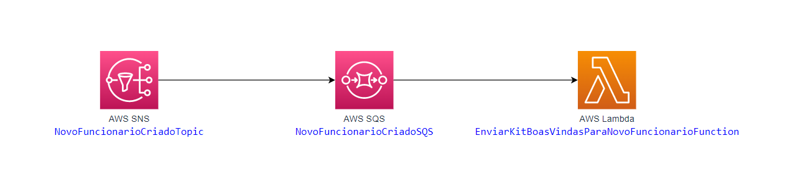

# AWS SAM - Creating Lambda with SQS and SNS subscription

Hello, everyone.

This project contains source code and supporting files for a serverless application using Lambda and SQS/SNS subscription.

If you prefer you can follow this source code in the video bellow:

https://youtu.be/dRyLRcAwBqk

## Modeling

Here you can see what we build during the video:

